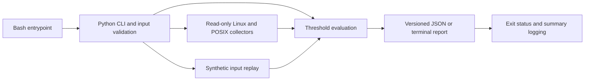

# Linux operations toolkit

A read-only Bash and Python toolkit for triaging Linux hosts with explicit health
policy, machine-readable results, and reproducible failure cases. This is
lab/reference engineering work. It neither remediates a host nor establishes
production readiness.

The practical problem is ambiguity: a missing command is different from a
healthy service, and a recent backup file does not establish recoverability.
This CLI reports these distinctions instead of printing unconditional success.



## Prerequisites and quickstart

Use Python **3.11 or later**, Bash **3.2 or later**, Git, and Make. The runtime
has **no Python package dependencies**. Linux with readable `/proc` is the target;
macOS supports development, fixtures, filesystem checks, and numeric identity.
`ss` supplies sockets, `systemctl` services/timers, `journalctl` journal metadata,
`getfacl` ACL counts, `openssl` certificate expiry, and `dpkg-query` or `rpm`
package counts. Their absence is reported explicitly.

From a checkout of this repository:

```bash
make help
make bootstrap
make doctor
make validate
make demo
make security
```

Bootstrap downloads checksum-pinned developer tools into `.tools` and installs
hash-locked Ruff in `.venv`; it does not install global packages. Network access
is required for first bootstrap. See [dependency provenance](docs/dependencies.md)
for exact versions, platforms, official sources and advisory limitations.
If `python3` is older than 3.11, use `make PYTHON=/path/to/python3.14 bootstrap`.
The CLI prefers the local virtual environment when present.

On Linux, run the default health checks:

```bash
bin/ops-toolkit health --format json
make integration
```

Default health checks are CPU busy percentage, load per visible CPU, memory,
filesystem capacity, inode capacity, process states/count, and socket counts.
An idle healthy Linux machine usually returns 0; host conditions may return 1.
Missing sources return 3. On macOS the default Linux checks return 3; this is
expected unsupported behavior, not a passing Linux integration test.

Portable live checks and explicit Linux inspections:

```bash
bin/ops-toolkit health --checks disk,inodes --disk-path . --format json
bin/ops-toolkit inspect --sections paths,identity,tools --path README.md
bin/ops-toolkit health --checks services --service ssh.service
bin/ops-toolkit inspect --sections paths --path README.md --acl
bin/ops-toolkit inspect --sections journal,schedules,packages,tools
```

Service names differ across distributions (`ssh.service` versus `sshd.service`).
Choose an existing unit explicitly; a missing unit is unavailable. Inspection
counts installed packages, schedules and diagnostic capabilities. It does not
audit package vulnerabilities or claim that a schedule actually executed.

## Results and policy

Each report carries `schema_version`, version, timestamp, platform, `source`
(`live` or `fixture`), checks and `exit_code`. Checks contain a name, status,
message and metrics. Status is `OK`, `WARN`, or `UNKNOWN`.

| Exit | Meaning |
| --- | --- |
| 0 | All requested checks are available and meet their policy |
| 1 | At least one check reaches a health threshold or a service is inactive |
| 2 | Invalid arguments, configuration or fixture |
| 3 | At least one source/tool is unavailable, denied, malformed or timed out |

Unavailability takes precedence over degradation in the process exit code;
the JSON retains every individual result. Argument-parser syntax errors use
stderr and exit 2. Valid command requests with invalid configuration can emit a
structured JSON error. `--verbose` writes summary-only logging to stderr.

Configuration and fixture JSON must be regular files, not symlinks, devices or FIFOs.
Duplicate keys, control characters, non-finite values and unknown policy keys are rejected.

Configure individual thresholds with `--threshold NAME=NUMBER`, or a JSON file:

```json
{"thresholds": {"cpu_pct": 85, "memory_pct": 85, "disk_pct": 85,
  "inodes_pct": 85, "load_per_cpu": 1.5, "process_count": 1000,
  "certificate_days": 30, "backup_hours": 24}}
```

```bash
bin/ops-toolkit health --checks disk --disk-path . --threshold disk_pct=90
bin/ops-toolkit health --checks certificate --certificate ./public-certificate.crt
bin/ops-toolkit health --checks backup --backup ./backup-complete.marker --threshold backup_hours=12
```

The last two commands require files you explicitly provide. Certificate checks
read expiry only; they do not validate trust chains or hostnames. Backup checks
inspect file mtime only; they never open backup contents or prove restoration.
The [demo walkthrough](docs/demo.md) provides a self-contained synthetic
fault/recovery sequence without requiring certificates or backup data.

## Validation and operations

`make validate` runs Ruff, ShellCheck, shfmt, actionlint, repository/document
checks and standard-library unit tests. `make demo` asserts healthy, degraded,
unavailable and invalid outcomes and performs live portable checks.
`make integration` requires Linux and exercises real `/proc` collectors; missing
required live sources fail that profile. `make security` scans the outgoing
working files, staged contents and complete Git history with Gitleaks.

See [acceptance](docs/acceptance.md), [validation evidence](docs/validation.md),
[architecture](docs/architecture.md), [design decision](docs/decisions/0001-stdlib-read-only.md)
and [triage runbook](docs/runbooks/triage.md). CI uses standard hosted Ubuntu
and pinned actions with read-only permissions. Passing fixture tests is kept
separate from live Linux execution and remote CI status.

## Security, resources and teardown

Run unprivileged. No default command changes system configuration, attaches to
processes, captures packets, calls a cloud API, opens remote TLS connections or
starts a service. Explicit metadata paths may reveal ownership and mode;
review output before sharing. Process arguments, socket addresses, journal
messages, account names and package names are omitted from reports.

External commands have a configurable deadline (`--timeout`, 0.1–60 seconds).
CPU sampling defaults to 0.1 seconds. File reads and streamed command output are size-bounded; filesystem calls are not covered by the subprocess deadline. Avoid
stale network mounts and untrusted executables. See [security policy](SECURITY.md).

There are no paid services, cloud resources, privileged containers or VMs in
the core demo. Suggested development budget: one CPU, 256 MiB for the toolkit
and up to 500 MiB disk for developer tools/caches. These are planning allowances,
not measured benchmarks; resource use depends on visible process counts and
external commands. Developer binary locks cover the documented macOS/Linux
platforms; other platforms must not be called reproducible without verification.

`make clean` removes only the repository's ignored `.runtime` directory. The
fixture/portable demo creates no resources; integration uses automatically cleaned temporary files. `.venv` and `.tools` are
retained for repeat runs. There are no host services, listeners or cloud assets
to tear down.

## Limits and extensions

CPU, load and memory describe OS-visible sources, not container cgroup quotas.
Inspection is a bounded inventory, not a compliance audit. ACL counts are not
an effective-access decision. Journald visibility depends on caller access.
The Linux integration profile does not establish systemd boot/reboot behavior,
SELinux/AppArmor policy, package-manager mutation or network isolation.

Planned extensions include cgroup-aware policy, schema compatibility tests,
an optional real-systemd VM matrix, and richer package inventory with explicit
privacy choices. None is claimed as implemented until separately tested.

This repository's original code is [MIT licensed](LICENSE); downloaded developer
tools retain their own licenses and are not vendored. Publication instructions
and the credential-free dry-run are in [publishing](docs/publishing.md).
